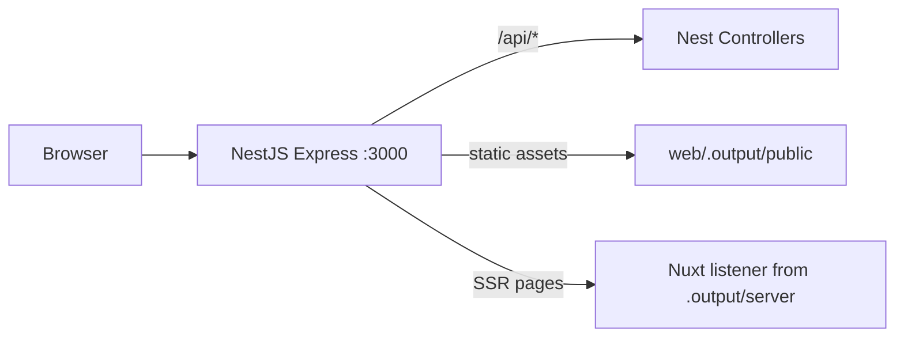

# Workspace Context: NestJS + Nuxt 4 Single-Port Stack

Use this document when moving the project to a **new separate workspace** or onboarding a new session. It captures architecture, implementation decisions, gotchas, and how to continue development.

## Origin

- **Created in:** `/opt/odoo/coolsam-odoo-addons/nest-nuxt-stack/` (inside an Odoo addons monorepo, but the stack is standalone and unrelated to Odoo)
- **Goal:** Serve NestJS (API) and Nuxt 4 (SSR) on a **single port**, with **NestJS owning the HTTP server** in production
- **Stack:** NestJS 11, Nuxt 4.4, pnpm workspaces, TypeScript

## Moving to a New Workspace

```bash
# Option A: copy the folder out
cp -a /opt/odoo/coolsam-odoo-addons/nest-nuxt-stack ~/projects/nest-nuxt-stack
cd ~/projects/nest-nuxt-stack

# Option B: move and init fresh git
mv /opt/odoo/coolsam-odoo-addons/nest-nuxt-stack ~/projects/nest-nuxt-stack
cd ~/projects/nest-nuxt-stack
git init

# Reinstall (don't copy node_modules)
rm -rf node_modules apps/*/node_modules
corepack enable
pnpm install

# Verify
pnpm build
pnpm start:prod   # http://localhost:3000
pnpm dev          # http://localhost:3000 (proxied Nuxt HMR)
```

**Do not copy:** `node_modules/`, `apps/api/dist/`, `apps/web/.output/`, `apps/web/.nuxt/` — regenerate with `pnpm install` and `pnpm build`.

---

## Architecture



### Routing contract

| Path | Handler | Mode |
|------|---------|------|
| `/api/*` | NestJS only | prod + dev |
| `/_nuxt/*`, pages, SSR | Nuxt | prod via `listener`, dev via proxy |
| Everything else | Nuxt SSR | prod + dev |

**Rule:** Business APIs live **only** in Nest (`apps/api`). Do **not** add `server/api/` routes in Nuxt — that creates a second backend inside Nitro and breaks routing.

---

## Repository Layout

```
nest-nuxt-stack/
├── package.json                 # root scripts: dev, build, start:prod
├── pnpm-workspace.yaml          # apps/*, packages/*; allowBuilds for native deps
├── Dockerfile
├── README.md
├── WORKSPACE_CONTEXT.md         # this file
├── apps/
│   ├── api/                     # NestJS — HTTP entry point
│   │   └── src/
│   │       ├── main.ts          # bootstrap, prod mount, dev WS proxy
│   │       ├── app.module.ts    # dynamic module: prod vs dev wiring
│   │       ├── health.controller.ts      # GET /api/health
│   │       ├── nuxt-fallback.controller.ts  # prod: catch-all → Nuxt listener
│   │       └── nuxt-dev-proxy.middleware.ts   # dev: proxy non-API → Nuxt :3001
│   └── web/                     # Nuxt 4 SSR frontend
│       ├── nuxt.config.ts       # node-listener preset, runtimeConfig, devServer
│       └── app/
│           ├── app.vue
│           └── pages/index.vue  # SSR-fetches /api/health
└── packages/
    └── shared/                  # shared types (HealthResponse)
```

---

## Production Flow

1. `pnpm build` runs **Nuxt first**, then Nest (`web` → `api`)
2. Nuxt emits `apps/web/.output/` with:
   - `server/index.mjs` — exports `{ listener }` (Node `(req, res)` handler)
   - `public/` — static assets (`/_nuxt/*`, etc.)
3. `NODE_ENV=production node apps/api/dist/main.js`:
   - Nest boots and registers `/api/health`
   - Mounts `express.static(.output/public)`
   - Registers `NuxtFallbackController` (`@All('*')`) which delegates to Nitro `listener`
   - Listens on `PORT` (default 3000)

### Critical: Nitro preset

Nuxt 4 default `node-server` **starts its own server** and does not export `listener`.

```ts
// apps/web/nuxt.config.ts
nitro: {
  preset: 'node-listener',  // REQUIRED for Nest integration
}
```

With `node-listener`, `.output/server/index.mjs` exports:
```js
export { handler, listener, websocket } from './chunks/nitro/nitro.mjs';
```

Reference: [Nuxt discussion #17845](https://github.com/nuxt/nuxt/discussions/17845), [Nitro node-listener](https://github.com/nuxt/nuxt/issues/30040#issuecomment-2500000000) (pi0's comment).

### Critical: Nest catch-all, not raw `express.use(listener)`

Mounting `listener` via `expressApp.use(listener)` **after** `app.init()` does not work — Nest's 404 handler intercepts first.

**Solution:** `NuxtFallbackController` with `@All('*')` registered only in production. It calls the listener for non-`/api` paths.

### Critical: SSR API base URL

During SSR, Nuxt runs inside the Nitro `listener`. A relative `$fetch('/api/health')` is handled **by Nitro**, not Nest → 404.

```vue
// apps/web/app/pages/index.vue
const apiBase = import.meta.server
  ? config.apiBaseServer   // http://127.0.0.1:3000/api
  : config.public.apiBase;  // /api (browser, same origin)
```

```ts
// apps/web/nuxt.config.ts
runtimeConfig: {
  apiBaseServer: process.env.API_BASE_SERVER ?? 'http://127.0.0.1:3000/api',
  public: { apiBase: '/api' },
}
```

---

## Development Flow

Two processes, **one user-facing port**:

| Process | Port | Role |
|---------|------|------|
| Nest (`pnpm --filter api dev`) | 3000 | User-facing; serves `/api/*`, proxies rest |
| Nuxt (`pnpm --filter web dev`) | 3001 | Internal; HMR, Vite, Nitro dev |

`pnpm dev` runs both via `concurrently`.

### Dev proxy wiring

- `NuxtDevProxyMiddleware` — Nest middleware, excludes `api/(.*)`, proxies to `http://127.0.0.1:3001`
- WebSocket upgrade handler in `main.ts` for Vite HMR (`/_nuxt`, etc.)
- `ENABLE_NUXT_PROXY=true` set in `apps/api/package.json` dev script

### Critical: Nuxt dev host must be `127.0.0.1`

Nuxt dev defaulted to IPv6 `[::1]:3001`. Proxy target `http://127.0.0.1:3001` failed with **504**.

```ts
// apps/web/nuxt.config.ts
devServer: {
  port: 3001,
  host: '127.0.0.1',
}
```

### Critical: Dev middleware path check

Use `req.originalUrl`, not `req.path`, to skip `/api` routes in proxy middleware.

---

## Environment Variables

| Variable | Default | Used by |
|----------|---------|---------|
| `PORT` | `3000` | Nest listen port |
| `NODE_ENV` | — | `production` enables Nuxt listener; dev uses proxy |
| `ENABLE_NUXT_PROXY` | — | `true` in api dev script |
| `NUXT_DEV_URL` | `http://127.0.0.1:3001` | Dev proxy target |
| `API_BASE_SERVER` | `http://127.0.0.1:3000/api` | Nuxt SSR → Nest API calls |

---

## Scripts Reference

```json
// root package.json
{
  "dev": "concurrently ... api + web",
  "build": "pnpm --filter web build && pnpm --filter api build",
  "start:prod": "NODE_ENV=production node apps/api/dist/main.js"
}
```

```json
// apps/api/package.json
{ "dev": "ENABLE_NUXT_PROXY=true nest start --watch" }
```

```json
// apps/web/package.json
{ "dev": "nuxt dev --port 3001" }
```

---

## Shared Package

`packages/shared` exports types used by both apps:

```ts
export interface HealthResponse {
  status: string;
  timestamp: string;
}
```

Referenced as `@nest-nuxt-stack/shared` via pnpm workspace (`workspace:*`).

---

## Approaches We Rejected

| Approach | Why not |
|----------|---------|
| Nest inside Nuxt Nitro plugin | Nitro owns the port; opposite of goal |
| Nuxt `server.node.ts` hosting Nest | Same — Nitro owns the port |
| `node-server` preset + `express.use(listener)` | No `listener` export; Nest 404 wins over middleware |
| Duplicate APIs in Nuxt `server/api/` | Two backends, routing ambiguity |
| Single-process dev without proxy | Loses HMR on Nuxt or Nest watch |

---

## Verified Smoke Tests

```bash
# Production
pnpm build && pnpm start:prod
curl http://localhost:3000/api/health          # {"status":"ok",...}
curl http://localhost:3000/ | grep 'Status:'   # SSR: Status: ok

# Development
pnpm dev
curl http://localhost:3000/api/health          # Nest JSON
curl http://localhost:3000/ | grep 'NestJS'    # Proxied Nuxt page with SSR health
```

Unit + e2e tests: `pnpm --filter api test && pnpm --filter api test:e2e`

---

## Continuing Development

### Add a new API endpoint

1. Add controller/service in `apps/api/src/`
2. Use route prefix `api/...` on the controller (e.g. `@Controller('api/users')`) — no global prefix is set
3. Call from Nuxt with `useFetch(\`${apiBase}/users\`)` using the server/client base URL pattern above
4. Add shared DTOs to `packages/shared` if needed

### Add a new Nuxt page

1. Add `apps/web/app/pages/your-page.vue`
2. SSR data: always use `apiBaseServer` on server, `public.apiBase` on client
3. No `server/api/` unless it's Nuxt-only utility (not business API)

### Docker

```bash
docker build -t nest-nuxt-stack .
docker run -p 3000:3000 nest-nuxt-stack
```

See `Dockerfile` — copies `apps/api/dist` and `apps/web/.output`, runs `node apps/api/dist/main.js`.

### pnpm native builds

`pnpm-workspace.yaml` includes `allowBuilds` for `@parcel/watcher`, `esbuild`, `unrs-resolver`. Required on pnpm 11+.

---

## Key Files to Read First in a New Session

1. [`apps/api/src/main.ts`](apps/api/src/main.ts) — entry point, prod/dev branching
2. [`apps/api/src/app.module.ts`](apps/api/src/app.module.ts) — dynamic controllers/middleware
3. [`apps/web/nuxt.config.ts`](apps/web/nuxt.config.ts) — preset, runtimeConfig, devServer
4. [`apps/web/app/pages/index.vue`](apps/web/app/pages/index.vue) — SSR fetch pattern

---

## Current Sample API

- `GET /api/health` → `{ status: "ok", timestamp: "<ISO8601>" }`
- Implemented in `apps/api/src/health.controller.ts`
